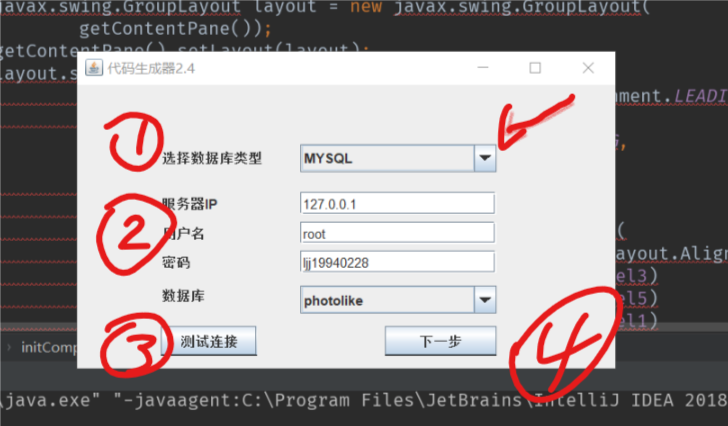
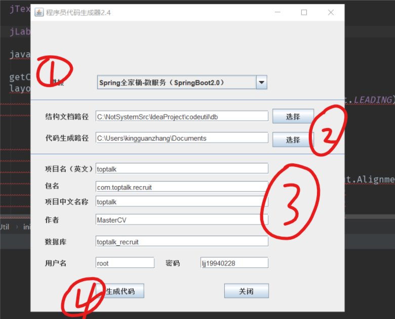

#### CodeuUtil

#### 项目介绍
代码生成器。可以根据数据库中的表生成可用于增删改查的代码模块;
可以生成分布式项目中单独模块完整的entity,dao,service,controller层;
基于模板开发，支持SSM 、Spring全家桶、Vue等工程的创建。

#### 使用说明

1. 配置主目录下的publicMap.xml文件中的所有标签的value值;
2. 进入src/main/java/ui 文件夹,点开DataBaseUtil类,启动此类中的main方法,会弹出一个swing绘制的对话框:

    
        
        看到此对话框后,根据下面步骤操作:
        1:选择你的数据库类型;
        2:填写你的数据库的连接数据;
        3:必须点击测试连接,否则无法选择数据表;
        4:点击下一步,之后会看到新的对话框;
   
    
    这是上面第4步后看到的新的对话框;
   
   
        继续按下面步骤操作:
        1:选择要生成的模板类型;
        2:结构文档路径直接使用默认的,只需要选择代码生成路径即可;
        3:继续填写下面的一些输入框;
        4:点击生成代码,然后去你选择的代码生成路径去找生成的文件即可;
        

#### 非原创,从别的地方找到的,一开始没有说明,摸索了一会才弄懂的
#### 喜欢请点个收藏吧

